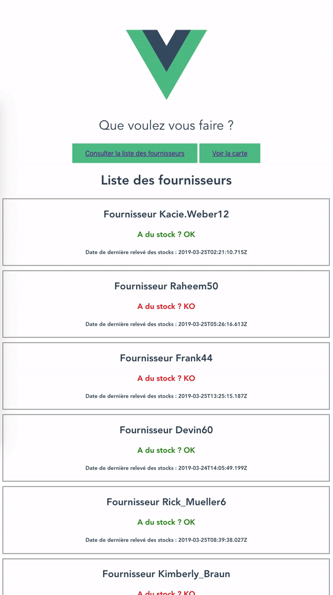
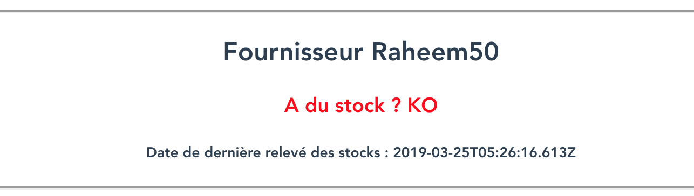
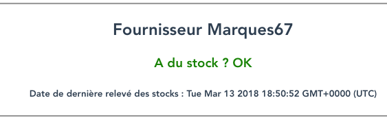
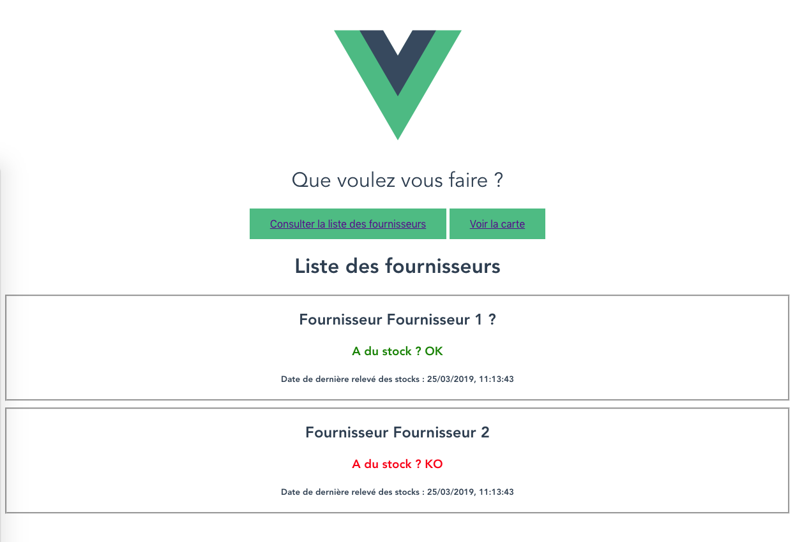
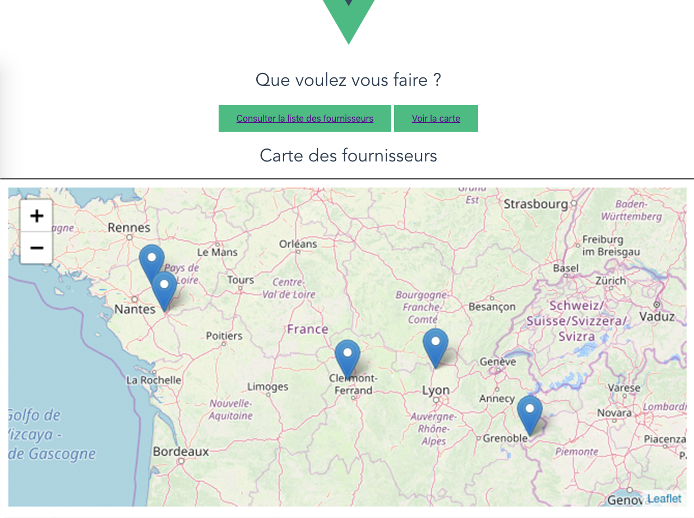

# Application de gestion des fournisseurs d'un site ecommerce.

Vous êtes le gérant d'un site ecommerce, ce site vend un produit unique : de la [spiruline](https://fr.wikipedia.org/wiki/Spiruline_%28compl%C3%A9ment_alimentaire%29). Afin de gérer vos stocks, vous souhaitez créer une application permettant de :

- lister vos fournisseurs de spiruline
- savoir si un fournisseur en a en stock
- afficher les fournisseurs sur une carte
- savoir quel est le fournisseur ayant du stock le plus proche pour faire une livraison rapide



### 1) Initialiser une application Vue.

- Commençons par créer une application VueJS, pour cela utilisons l'interface en ligne de commande officielle `vue-cli`.

Si ce n'est pas fait, il faut d'abord l'installer avec npm :

```
npm install --global @vue/cli
```

**Question :** Rappelez ce qu'est npm et pourquoi nous utilisons l'option `--global` ?

=>Option globale de npm permet d'installer de façon transversal afin de l'installer "partout" sur l'ordinateur et pas seulement sur le projet. 


**Votre réponse :**

Vérifier que la version de Vue CLI installée est au moins la version 3 :

```
vue --version
```
==> Ici @vue/cli 4.3.1
(NB: La version ecrite dans .json donne la version minimale pour ce projet ci)


Si jamais vous avez un message de type : "Command not found", vous pouvez suivre [ce tuto](https://www.technig.com/solve-vue-command-not-found-windows/)

- Créez maintenant l'application :

```
vue create NOM_PROJET
==> Il existe aussi pour creer: vue init webpack mon_projet
```
==> Youpi! 
🎉  Successfully created project spa_vuejs-suppliers-2021.
👉  Get started with the following commands:

 $ cd spa_vuejs-suppliers-2021
 $ npm run serve


Si des questions vous sont posées, choisissez les options par défaut.

**Question :** Quels sont les bons réflexes à avoir quand vous téléchargez un nouveau projet ? Quels fichiers regarder en priorité ?

**Votre réponse :**
On peu ouvrir package.json pour comprendre les dependances. On apprendra avec quelle version de vue le projet fonctionne et s'il a déjà des scripts à executer. (L'occasion aussi de se rendre compte peut-être si quelque chose manque?)

On remarquera aussi trois sections dans App.vue: template , script, style qui permettent respectivement de mettre du code HTML (le template), le code JavaScript (les données, les méthodes, les événements…) et le code CSS

On trouvera aussi le fichier index.html qui presente le point d’entrée de l’application. Il comporte uniquement le boilerplate html de base ainsi qu’une div avec l’id App qui servira de point de départ du code de l’application

On trouvera aussi le main.js, qui est le fichier “racine” de l’application. C’est lui qui va faire le lien entre la vue et le modèle dans notre cas (car oui, Vue.js utilise le MVVM).

Comment va s'articuler tout cela? :
-on importe Vue
-on importe notre composant App.
-On spécifie que le mode de production n’est pas active (si on est en dev)
-on créer un nouvel objet Vue qui prend en paramètre el qui est l’élément HTML qui a pour valeur notre point d’entrée de l’application (la balise Div avec l’id app), en deuxième argument la liste des composants enfants (ici App) et le template qui sera afficher dans la balise div#app

**Question :** Regardez le fichier `README.md`, quelle est la commande que nous allons utiliser pour travailler le projet ?

**Votre réponse :**

- Lancez le projet.
=> Se placer à l'interieur du projet avec cd projet_vue
Et pour lancer le projet on va simplement effectuer un npm run serve


### 2) Écran d'accueil.

Dans un premier temps, nous voulons changer l'écran d'accueil, ce dernier vous permettra de choisir entre consulter la liste des fournisseurs ou afficher la carte.

Faites les modifications nécessaires.

- Ajoutez dans votre composant App deux méthodes : `onSuppliersListClick` et `onMapClick` qui devront faire des [alertes](https://developer.mozilla.org/fr/docs/Web/API/Window/alert) pour marquer le fait qu'un utilisateur a cliqué dessus.

### 3) Préparation des écrans.

Nous voulons préparer les écrans de la liste des fournisseurs ainsi que celui de la carte. En VueJs tout est composant, si nous voulons un nouvel écran, il nous faut un nouveau composant.

- Créez donc deux fichiers `SuppliersList.vue` et `SuppliersMap.vue`. Les templates de ces composants seront très simples dans un premier temps, par exemple un simple titre h1 contenant 'Liste des fournisseurs' ou 'Carte des fournisseurs' est suffisant.

- Faites en sorte d'ajouter ces deux composants Vue au template de votre app.

➡️**Commiter dans git avec un message explicite, par exemple "fin étape 3" ou même "Ajout composants SuppliersList et SuppliersMap"**

### 4) Mise en place d'un routeur.

Le problème est que nous ne voulons pas avoir une seule page sur notre application.
Nous devons avoir la possibilité de naviguer d'une page à l'autre, sans recharger la page ou sans afficher une nouvelle page html : pour cela, nous avons besoin de mettre en place **un routeur**.

C'est la même chose que Laravel, sauf qu'ici le routeur est côté client, nous devons définir nos routes côté client et avoir moyen d'en changer.

Cela tombe bien, Vue a un routeur tout prêt que nous allons utiliser, [vue-router](https://router.vuejs.org/fr/)

##### 4.1) Installation.

Faites l'installation avec npm comme décrite dans la documentation. N'oublier pas d'ajouter après l'installation ces deux lignes :

```
import VueRouter from 'vue-router'

Vue.use(VueRouter)
```

##### 4.2) Configuration.

Nous voulons déclarer deux routes, une `/suppliers` avec la liste des fournisseurs et une `/map` qui contiendra la carte.

- Déclarez votre tableau de route dans le fichier `index.js` du répertoire `router` en faisant référence aux composants créés avant.

- Initialisez l'objet router de Vue contenant ces routes et injectez-le dans la création de l'app Vue, votre code doit ressembler à :

```
new Vue({
  router,
  render: h => h(App)
}).$mount("#app");
```

- Supprimez maintenant les composants `SuppliersList` et `SuppliersMap` du template de notre composant `App.vue`.

Vous devriez retomber sur un écran correspondant à l'étape 1 plus haut.

Nous avons initialisé notre composant mais nous ne l'avons pas utilisé.

##### 4.3) Utilisation.

Pour l'utiliser nous devons utiliser les deux composants fournis par VueRouter :

- `<router-view></router-view>` affiche le contenu de la route correspondant au composant spécifié dans la déclaration.
- `<router-link to="" ></router-link>` permet de passer d'une page à l'autre.

Ajoutez donc `<router-view></router-view>` à la fin du template de notre composant `App.vue` et utilisez `<router-link to="NOM_ROUTE" ></router-link>` pour passer d'une page à l'autre dans le même composant.

Voici le résultat que vous devriez obtenir : [GIF](http://recordit.co/26PagUagEA)

### 5) Création d'un composant pour représenter un fournisseur.

A ce stade, la liste de fournisseurs est vide, il n'y a donc pas de navigation possible à partir de la liste. Nous allons cependant créer la vue détaillée d'un fournisseur, qui pourra être rendue accessible soit via un bouton `<router-link to="..." ></router-link>` (temporaire) ou en saisissant l'URL directement comme indiqué en fin de section.

##### 5.1) Composant statique dans une nouvelle route.

Créez dans un premier temps une nouvelle route `'/supplier'` qui va représenter un nouveau composant à créer, `Supplier.vue`.

Ce composant aura comme `data` l'objet javascript suivant :

```
{
    name: 'Mon fournisseur',
    status: false, // est ce qu'il y a du stock
    checkedAt: new Date() // date de la dernière mise à jour du stock
}
```

et aura comme rendu quelque chose ressemblant à :



Si vous changez `status` en `true` alors :



Notes :

- Pour afficher la date, la méthode [toLocaleString()](https://developer.mozilla.org/fr/docs/Web/JavaScript/Reference/Objets_globaux/Date/toLocaleString) de `Date()` devrait vous aider.
- Ici un simple titre h1 est utilisé pour le nom, un h3 pour le statut et un h5 pour la date, vous pouvez bien évidemment l'adapter en fonction de vos envies.
- On a déclaré une route mais pas donné de lien explicite dans l'application pour y accéder, mais vous pouvez directement [changer l'url du navigateur](http://localhost:8080/#/supplier).

➡️**Faites un commit avec un message explicite**

##### 5.2) Passage de props au composant Supplier.

Nous avançons bien ! Notre dernier composant va nous aider à construire l'écran comprenant la liste de nos fournisseurs. Mais aujourd'hui il a une limite : on ne peut pas modifier le nom ni le statut du fournisseur sans toucher au code, il faut trouver un moyen de paramétrer notre composant. Pour cela nous allons utiliser la notion de props dans VueJS.

Pensez aux props comme aux paramètres d'une fonction :
Pour rendre paramétrable une fonction il faut ajouter des paramètres. Pour rendre paramétrable un composant, il faut ajouter des props.

- Dans un premier temps, appelez le composant `Supplier` dans le composant `SuppliersList`. Vous devriez donc avoir la même page aux urls `/suppliers` et `/supplier`.

- Ajoutez le fait que le composant `Supplier` a trois props qui s'appellent `name`, `status` et `checkedAt`, supprimez les datas du composant `Supplier`, mais ajoutez les dans le composant `SuppliersList`.

* Modifiez le composant `SuppliersList` pour passer les props `name`, `status` et `checkedAt`.

À ce stade, vous devriez avoir la même chose qu'avant en terme de rendu, néanmoins nous sommes prêts à faire notre liste de fournisseurs car nous avons un composant `Supplier` qui est paramétrable grâce aux props !

➡️**Faites un commit avec un message explicite**

### 6) Création d'une liste.

➡️ Modifiez le composant `SuppliersList` pour que sa data contienne l'objet suivant :

```js
{
  suppliers: [
    {
      id: 1,
      name: "Fournisseur 1 ?",
      status: true,
      checkedAt: new Date()
    },
    {
      id: 2,
      name: "Fournisseur 2",
      status: false,
      checkedAt: new Date()
    }
  ];
}
```

➡️ Bouclez maintenant sur cette donnée pour appeler autant de fois le composant `Supplier` qu'il y a d'objets dans cette nouvelle data de `SuppliersList`.

**Question :** Remarquez que nous avons ajouté une clef `id` à nos objets, pourquoi ?

**Votre réponse :**

➡️ Modifiez un peu le style pour que les éléments de la liste soient mieux visibles, voici un exemple de ce que vous pourriez obtenir :



➡️**Faites un commit avec un message explicite**

##### 6.1) Formattage des dates
Un timestamp complet n'est pas agréable à lire, encore moins répété dans une liste.
La librairie `timeago.js` nous permet de formatter les dates pour afficher un temps relatif, plus parlant.

➡️ Ajoutez la libraire à votre projet avec npm pour afficher la valeur de `checkedAt` avec un temps relatif.

https://github.com/hustcc/timeago.js

> Il est toujours fondamental de savoir évaluer avant de se lancer un package ou un projet sur github ou même npm.

**Question :** Prenez le temps de regarder la page, qu'est ce qui vous inspire confiance, ou au contraire, méfiance ?

**Votre réponse :**

➡️**Faites un commit avec un message explicite**

### 7) Création d'une map.

Maintenant, essayons de visualiser les différents fournisseurs sur une carte, chacun avec un marqueur.

##### 7.1) Map vide

Pour afficher une carte nous allons utiliser le fond de carte OpenStreetMap avec la librairie Leaflet, grâce à un package spécialement créé pour Vue.

Ce package, **Vue2Leaflet**,  est disponible à [cette adresse](https://github.com/vue-leaflet/Vue2Leaflet).
➡️ Ajoutez cette libraire à votre projet en reprenant cet exemple : https://github.com/Romainpetit/leaflet-vue

**Question :** Cherchez puis listez au minimum 3 autres packages qui permettraient d'afficher une carte en javascript. Quels sont leur différences avec Leaflet pour OpenStreetMap ?

**Votre réponse :**

➡️ Affichez une carte dans votre composant `SuppliersMap`

Prenez le temps de jouer sur les paramètres pour les comprendre.

➡️**Faites un commit avec un message explicite**

##### 7.3) Ajouter les marqueurs.

Dans un premier temps consultez la liste d'exemples du projet et trouvez un moyen d'ajouter des marqueurs sur la carte.

Maintenant ajoutez une propriété `suppliers` à la data du composant qui a la forme suivante :

```js
suppliers: [
  {
    id: 1,
    latitude: 10,
    longitude: 10
  },
  {
    id: 2,
    latitude: 11,
    longitude: 9.6
  }
];
```

En utilisant un `v-for`, affichez des marqueurs aux deux positions des fournisseurs spécifiées.

Voici un exemple de rendu : 

➡️**Faites un commit avec un message explicite**

### 8) Récupérer les données via une API externe.

☝️**Préambule - Point d'étape sur l'architecture de l'application**

Avant de passer à l'étape suivante, nous allons passer en revue l'architecture de notre application Vue.js.
Pour cela, constituez un tableau à 2 colonnes, la première colonne représentant le serveur web et la 2ème le navigateur web. Par exemple :

Serveur web | Navigateur web
--- | ---
abc | def
ghi | ...


Répartissez ensuite les étapes ci-dessous dans les 2 colonnes, selon qu’elles sont traitées selon vous par le serveur ou le navigateur :
- Stocker les données de l’application
- Router les requêtes HTTP
- Effectuer le rendu des pages web
- Afficher les pages web
- Exécuter le code métier de l’application

Effectuez l’exercice pour une application Laravel, puis pour une application Vue.js.

➡️ Constatez les différences : comment sécuriser l’accès aux données de l’application dans ce 2ème cas ?

**Votre réponse :**


Fin du préambule
* * *


Nous avons créé pour vous une API REST permettant de gérer vos fournisseurs. Cette api est disponible à cette url : [https://api-suppliers.herokuapp.com/api](https://api-suppliers.herokuapp.com/api). Et la documentation [ici](https://api-suppliers.herokuapp.com/).

Par exemple pour lister l'ensemble des fournisseurs il faudra appeler [cette URL](https://api-suppliers.herokuapp.com/api/suppliers)

Si vous faites le test, vous verrez que le résultat n'est pas très lisible. La réponse de l'API est au format [JSON](https://developer.mozilla.org/fr/docs/Learn/JavaScript/Objects/JSON), un standard dans le monde du web.

Il existe des plugins sous chrome permettant de visualiser un résultat JSON de facon plus propre : par exemple sous chrome vous pouvez installer ce [plugin](https://chrome.google.com/webstore/detail/jsonview/chklaanhfefbnpoihckbnefhakgolnmc).

Il est important de comprendre les principaux verbes d'une API HTTP et de savoir lire une documentation pour connaitre ses possibilités et ses limitations, prenez quelques minutes pour bien comprendre la documentation de cette API.

L'API contient notamment la liste des fournisseurs que nous allons récupérer pour adapter nos vues de liste et de carte.

⚠️**Ne passez pas à côté de cette partie, les notions mises en jeu sont fondamentales.**

##### 8.1) Installation d'une librairie permettant de faire des appels HTTP.

Pour pouvoir faire des appels à une API, VueJS préconise l'utilisation de la librairie [axios](https://github.com/axios/axios).

Prenez toujours le temps d'analyser cette librairie sur github, qu'est ce qui vous inspire confiance ? Ayez le réflexe de chercher la librairie sur [npm](https://www.npmjs.com/package/axios) pour notamment voir le nombre de téléchargements.

- Installez la librairie avec npm.

➡️**Faites un commit avec un message explicite**

##### 8.2) Notion de promesses.

- La notion de promesses est fondamentale en javascript, prenez le temps de lire en détail [la documentation](https://developer.mozilla.org/fr/docs/Web/JavaScript/Guide/Utiliser_les_promesses).

- Réalisez ensuite le [cours 12 du cours de CodeAcademy sur les promesses](https://www.codecademy.com/learn/introduction-to-javascript/modules/javascript-promises).

☝️**Prenez le temps de solliciter les formateurs pour faire le point sur ce que vous avez compris :**

- Quel problème cherchons nous à résoudre ?
- Quelle est la solution proposée ?
- Comment la mettre en oeuvre ?

##### 8.3) Utilisation dans le projet.

Nous allons afficher la liste des fournisseurs provenant de cette [route](https://api-suppliers.herokuapp.com/api/suppliers).

Comme vous le savez une promesse a plusieurs états :

- En cours.
- Terminée et succès.
- Terminée et erreur.

Nous devons suivre ces états dans notre composant, ajoutez donc aux datas deux clefs `loading` et `error` permettant de savoir si la requête est en cours et si il y a eu une erreur.

Aussi, enlevez les fournisseurs que nous avions mis tout à l'heure de l'objet data.

Votre data devrait ressembler à ça :

```js
data: function() {
    return {
      suppliers: [], // au début la liste des fournisseurs est vide
      loading: false,
      error: null,
    }
}
```

Avant d'aller plus loin, il faut choisir quand lancer la requête, la solution communément admise est de dire : "Quand le composant est créé, lance la requête".

Vuejs nous permet de déclencher des actions ( ou _hooks_ ) à certains moments précis de la vie d'un composant. La liste est disponible [ici](https://fr.vuejs.org/v2/api/index.html#Options-Cycle-de-vie-des-hooks). Celui qui nous intéresse est le `created`.

- Ajoutez donc l'appel http avec axios permettant d'afficher la liste des fournisseurs.

- Faites en sorte d'afficher un texte `requête en cours` si jamais la requête est en cours et une erreur en rouge si jamais la requête produit une erreur.

➡️**Faites un commit avec un message explicite**

##### 8.4) Mise à jour du composant SuppliersMap.

Faites la même chose pour le composant `SuppliersMap` afin qu'il affiche tous les marqueurs des fournisseurs de l'API.

##### 8.5) Eviter le doublon.

Si vous faites attention, nous faisons le même appel http dans nos deux composants, cela fonctionne mais ce n'est pas optimal : l'utilisateur va attendre deux fois pour consulter les mêmes données.

- Quelles idées avez vous pour répondre à ce problème ?

- Essayez de mettre en oeuvre une solution.

### 9) Aller plus loin.

##### 9.1) Centrer la carte par rapport à sa localisation.

- Pour rendre plus pratique son utilisation, faites en sorte que la carte soit centrée par rapport à la position de l'utilisateur utilisant la carte.

Documentation de l'API du navigateur pour la [géolocalisation](https://developer.mozilla.org/fr/docs/Web/API/Navigator)

##### 9.2) Filtrer la liste des fournisseurs.

Nous voulons permettre à l'utilisateur de visualiser uniquement les fournisseurs qui ont le même statut.

- Ajoutez un select avec trois entrées ( "ok", "ko", "\*" ) permettant de filtrer les fournisseurs en fonction de leur statut.

##### 9.3) Ajouter un nouveau fournisseur.

Faites un formulaire qui permet d'ajouter un nouveau fournisseur et utilisez l'API pour l'ajouter en base de données.

##### 9.4) Modifier ou supprimer un fournisseur existant.

Faites la même chose pour une modification ou suppression de fournisseur. ( Attention à ne pas tout supprimer, vous travaillez tous sur la même base de données !).

### 10) Packager l'application en PWA.

Voir prochain sujet.

### 11) Aller ( encore ) plus loin.

Laravel et Vue ayant une très bonne intégration, refaites l'API avec LARAVEL.

Vous pouvez y ajouter un système d'authentification permettant de ne voir les fournisseurs que si vous êtes connecté, et n'autorisant la création/modification/suppression que si l'utilisateur a un rôle d'admin [DOC](https://laravel.com/docs/5.6/passport)
